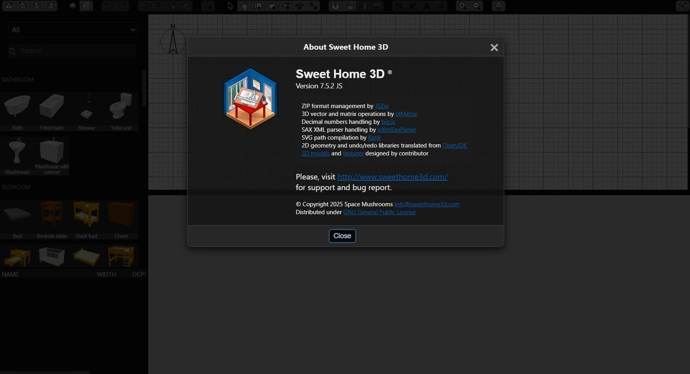

# SweetHome3DJS

[](https://www.gnu.org/licenses/old-licenses/gpl-2.0.en.html)



[SweetHome3DJS][project-url] is a web-based version of the popular interior design application [Sweet Home 3D](http://www.sweethome3d.com/), originally implemented in Java. This project represents a work-in-progress effort to refactor and modernize the existing SweetHome3DJS implementation.

## 🏠 About Sweet Home 3D

Sweet Home 3D is a free interior design application that helps you draw the plan of your house, arrange furniture on it, and visit the results in 3D. The original application is written in Java and runs as a desktop application.

## 🔧 Project Goals

This project aims to evolve the existing SweetHome3DJS implementation by:

- Eliminating Java toolchains dependency
- Refactoring the codebase to use modern frontend technologies:
  - NPM toolchain
  - ECMAScript Modules (ESM)
  - TypeScript
- Making the application more familiar to modern frontend developers
- Improving maintainability and extensibility

> [!WARNING]
> This project is a WORK IN PROGRESS and is NOT READY FOR PRODUCTION USE. 
> 
> Critical features such as import, export, save, and load functionalities require significant refactoring and additional development before this application can be considered stable for production environments. Users should exercise extreme caution and expect incomplete or non-functional features.

## Tasks

- [ ] Refactor existing codebase to use modern frontend technologies
- [ ] Eliminate dependency on Java toolchains
- [ ] Improve application familiarity for modern frontend developers
- [ ] Enhance maintainability and extensibility
- [ ] Resolve Vite and TypeScript configuration issues
- [ ] Fix missing type declarations for core dependencies
- [ ] Address PNPM package management conflicts

## 🚀 Getting Started

### Prerequisites

- Node.js (version 16 or higher)
- npm or pnpm package manager

### Installation

```bash
# Clone the repository
git clone https://github.com/luxvitae-eco/SweetHome3DJS.git

# Navigate to the project directory
cd SweetHome3DJS

# Install dependencies
pnpm install
```

### Development

```bash
# Start the development server
pnpm dev
```

### Building for Production

```bash
# Build the application
pnpm build
```

## 📁 Project Structure

```
SweetHome3DJS/
├── public/                 # Static assets
│   └── lib/                # Library files and resources
├── src/                    # Source code
│   ├── HomeRecorder/       # Home recording functionality
│   ├── UserPreferences/    # User preferences management
│   └── ...                 # Other core modules
├── index.html              # Main HTML entry point
├── package.json            # Project dependencies and scripts
└── vite.config.ts          # Vite configuration
```

## 🛠️ Technologies Used

- [Vite](https://vitejs.dev/) - Next generation frontend tooling
- [TypeScript](https://www.typescriptlang.org/) - Typed JavaScript
- [ES Modules](https://developer.mozilla.org/en-US/docs/Web/JavaScript/Guide/Modules) - Modern JavaScript module system
- Custom 3D rendering engine based on WebGL

## 📝 License

This project is licensed under the GNU General Public License v2.0 - see the [LICENSE](LICENSE) file for details.

The original Sweet Home 3D is also licensed under GPL v2.0. This web adaptation maintains the same licensing terms to ensure compatibility and openness.

## 🙏 Acknowledgments

- Original Sweet Home 3D project by Emmanuel Puybaret
- [luxvitae-eco](https://github.com/luxvitae-eco) for the ongoing refactoring efforts


[project-url]: https://github.com/luxvitae-eco/SweetHome3DJS